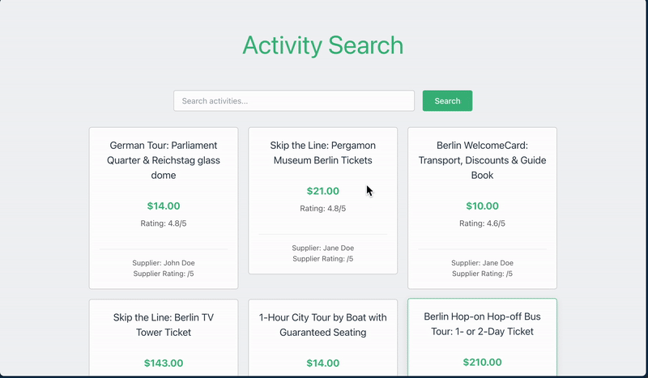

[

# Activities Search Application

## Project Overview

This project is a web application that allows users to search for activities. It consists of a Spring Boot backend that exposes a REST API and a Vue.js frontend that consumes this API. Users can search for activities by title, and the application displays relevant details such as price, rating, special offers, and supplier information.

## Technologies Used

- **Backend**: Spring Boot
- **Frontend**: Vue.js
- **Database**: In-memory data (loaded from a JSON file or JPA)
- **Containerization**: Docker
- **API Communication**: REST

## Features

- **Search Functionality**: Users can search for activities by title.
- **Display Information**: The application displays the following fields for each activity:
    - Title
    - Price with currency
    - Rating
    - Special offer status
    - Supplier name and location
- **Flexible Data Source**: The application can load activities from different sources (JSON or JPA) based on configuration.
- **Responsive UI**: The frontend is designed to be user-friendly and responsive.

## Architectural Decisions

1. **Backend API**: The backend is designed to expose a REST API that allows the frontend to fetch activities based on search queries. This decision was made to keep the client lightweight and to leverage server-side capabilities for data retrieval.
   The jpa added just to show we can extend application using different sources not only json.
2. **Server-Side Filtering Logic**: The filtering logic is centralized on the server side. This design choice allows for better scalability and enables other clients, such as mobile applications, and applying caching, indexing on server improving the performance, and to utilize the same API for fetching activities. The client sends a search query to the server, which processes the request and returns only the relevant activities.

3. **Flexible Data Source Configuration**: The application supports loading activities from different sources by specifying the `activity.repository.type` in the `application.properties` file. You can set it to `json` to load from a JSON file or `jpa` to load from a database. This flexibility allows for easier testing and integration with different data sources.

4. **Containerization**: The application is containerized using Docker to ensure that it can be easily run in any environment. A `docker-compose.yml` file is provided to facilitate the setup of both the backend and frontend services.

## Setup Instructions

To run the application locally, follow these steps:

1. **Clone the Repository**:
   ```bash
   cd <repository-directory>
   ```

2. **Build and Run with Docker**:
   Make sure you have Docker and Docker installed. Then run:
   ```bash
    docker compose up --build
   ```

3. **Access the Application**:
   Once the application is running, you can access it at http://localhost:8081.


4. **(Optional) Run Tests**:
   ```bash
   gradle test
   ```

5.  **(Optional)Configuration: You can specify the data source in the application.properties file:**

    ```properties
    activity.repository.type=json  # For loading from JSON
    # or
    activity.repository.type=jpa    # For loading from JPA
    ```
6. Improvements Left Out

    - **Pagination**: Implement pagination to handle large datasets.
    - **Authentication**: Add authentication to secure the API and frontend.
    - **Error Handling**: While basic error handling is implemented, more robust error handling could be added to provide better user feedback in case of API failures.
    - **Loading States**: Implementing loading indicators while fetching data from the API would enhance user experience.
    - **Testing**: Adding unit and integration tests for both the backend and frontend components would improve code reliability and maintainability.
    - **Styling Enhancements**: The UI could be further enhanced with better styling and layout adjustments for a more polished look.


